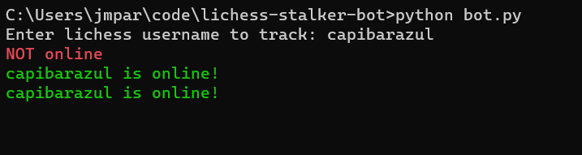

# Lichess Stalker Bot

This is a Python script to know when your friend or you favorite lichess user is online

  

## How to run

You will need to install Python if you do not have it already. I coded it using version 3.11.5
Then from inside the directory open a command console and enter:

```console 
python bot.py
```

If it does not work you might need to install playsound and/or wheel. Try:

```console 
pip install wheel
```   
```console
pip install playsound
```

## How to exit the script

Press ```Ctrl+C``` or ```Ctrl+Z``` to interrupt the script.
